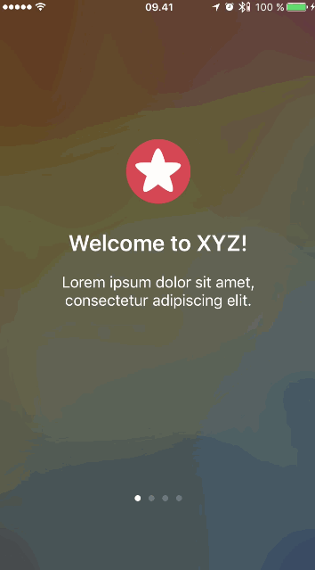

# parallax-scrolling-example
A project for trying out an implementation of parallax scrolling in an onboarding flow

## Running the project
The project uses Cocoapods. Run `pod install` and open the project using `Parallax-scrolling.xcworkspace`.

## Demo GIF
